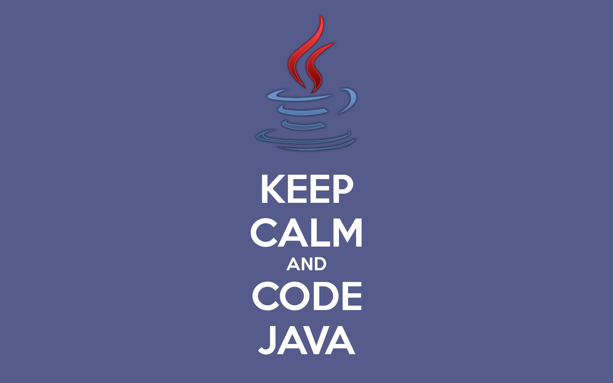

# Java_Developer_RoadMap
# Java Programming Language Bootcamp

Welcome to the Java Programming Language Bootcamp repository! This bootcamp is designed to take you through the fundamentals of Java programming, providing you with a solid foundation to build upon. Whether you're a beginner or looking to refresh your Java skills, this repository is the perfect place to start your journey.

## Table of Contents

- [Introduction](#introduction)
- [Prerequisites](#prerequisites)
- [Getting Started](#getting-started)
- [Curriculum](#curriculum)
- [Contributing](#contributing)
- [Feedback](#feedback)

## Introduction

Java is a powerful and versatile programming language widely used in various domains, including web development, mobile app development, and enterprise applications. In this bootcamp, you'll learn the core concepts of Java, including variables, data types, control structures, object-oriented programming, and more.

## Prerequisites

Before you start the bootcamp, it's helpful to have some basic knowledge of programming concepts. Familiarity with any programming language would be beneficial, but it's not a strict requirement. A passion for learning and problem-solving is all you need to succeed in this bootcamp.

## Getting Started

To get started with the bootcamp, follow these steps:

1. **Clone the Repository**: Clone this repository to your local machine using the following command:
https://github.com/Dastanoyx/RoadMap_Java_Developer.git

2. **Install Java Development Kit (JDK)**: Ensure you have the latest version of JDK installed on your computer. You can download JDK from the official Oracle website or adopt OpenJDK.

3. **Install an Integrated Development Environment (IDE)**: We recommend using an IDE like Eclipse, IntelliJ IDEA, or Visual Studio Code for a better development experience.

4. **Explore the Curriculum**: Check the `Curriculum` section of this README to see the topics covered in the bootcamp.

5. **Start Learning**: Begin with the first lesson and follow along with the exercises. Each lesson is organized in its own folder and includes detailed explanations and code examples.

6. **Practice Regularly**: Practice coding regularly to reinforce your understanding and improve your skills.

## Curriculum

The bootcamp covers the following topics:

1. Introduction to Java
2. Variables and Data Types
3. Control Structures (if-else, loops)
4. Arrays
5. Object-Oriented Programming (Classes, Objects, Inheritance, Polymorphism)
6. Exception Handling
7. File Input/Output
8. Java Collections Framework etc...

Each topic will have its own folder with relevant resources, exercises, and assignments.

## Contributing

Contributions to this bootcamp are always welcome! If you find any errors, typos, or want to add more examples or exercises, feel free to create a pull request. Please adhere to the coding style and directory structure as used in the repository.

## Feedback

We value your feedback! If you have any suggestions, questions, or concerns, please open an issue on this repository. We are continuously working to improve the bootcamp and your input is highly appreciated.

---

Happy coding! We hope this bootcamp will provide you with an enjoyable and valuable learning experience. If you have any further questions, don't hesitate to reach out. Let's start exploring the world of Java together!

